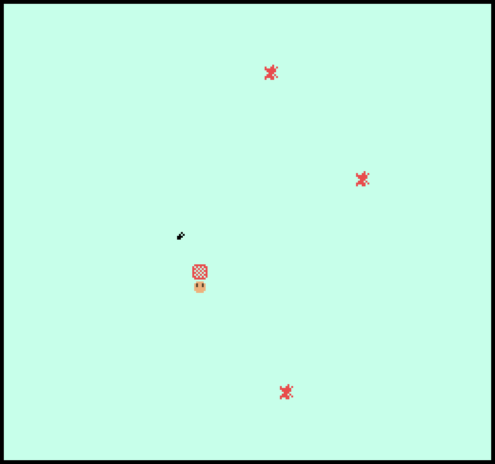

# Bug Swatter

Author: Jonathan Yan

Design: Vent your frustrations against all of bugkind in a game where you swat giant human-sized bugs.

Screen Shot:

How Your Asset Pipeline Works:

The pipeline uses the binary in asset\_pipeline/convert\_assets to convert any png spritesheet to a loadable asset file. Spritesheets must have at most 4 unique colors (including transparency), and be made of whole 8x8 sprites.

How To Play:

Arrow keys to move, and space to swat. Bugs will leave behind giant messes of blood that are impassable, so take care not to get trapped. Press R to restart.

Sources: The lack of both quantity and quality of assets should indicated that all were self-made :)

This game was built with [NEST](NEST.md).

